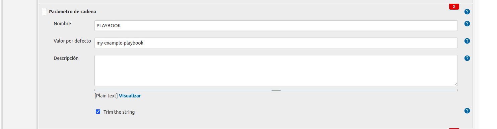
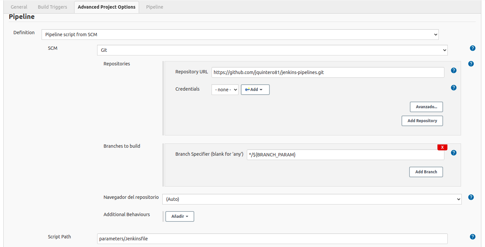

## Example of use

- We have used a Docker image running in 8080 port.
- This is our Job Configuration:

## Defining parameters

## Configuring git repository

It is very important to uncheck "Lightweight checkout"